# Library Management System

---

## Screenshots

### Containers Running
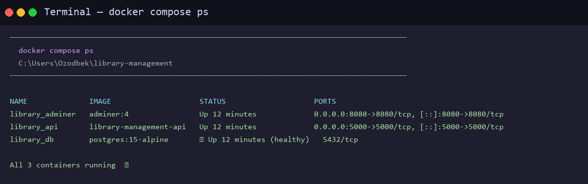

### Docker Images (Custom Build)
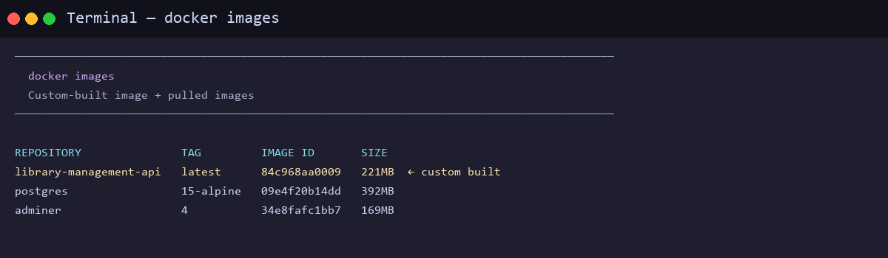

### GET /books — All Books with Availability
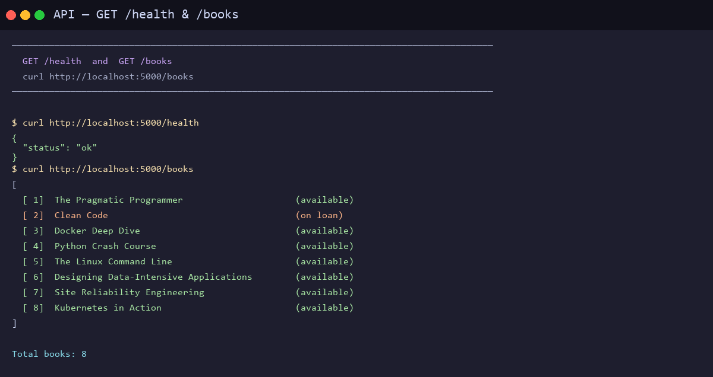

### POST Operations — Create Book, User, Loan
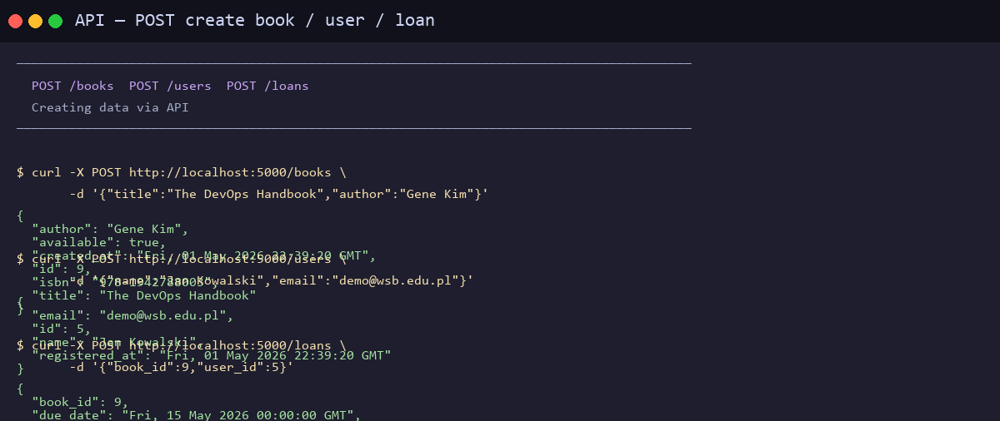

### Loan Tracking & Overdue Detection
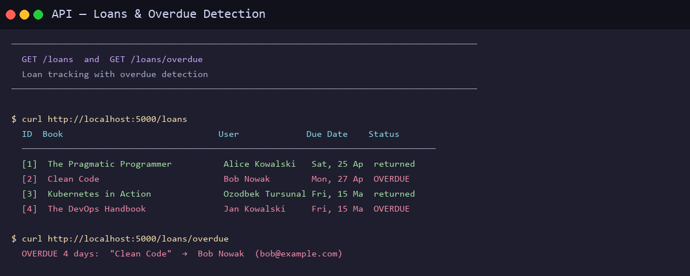

### Return Book Flow
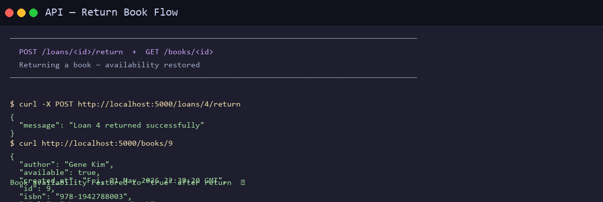

### Automated Test Suite — 17/17 Passed
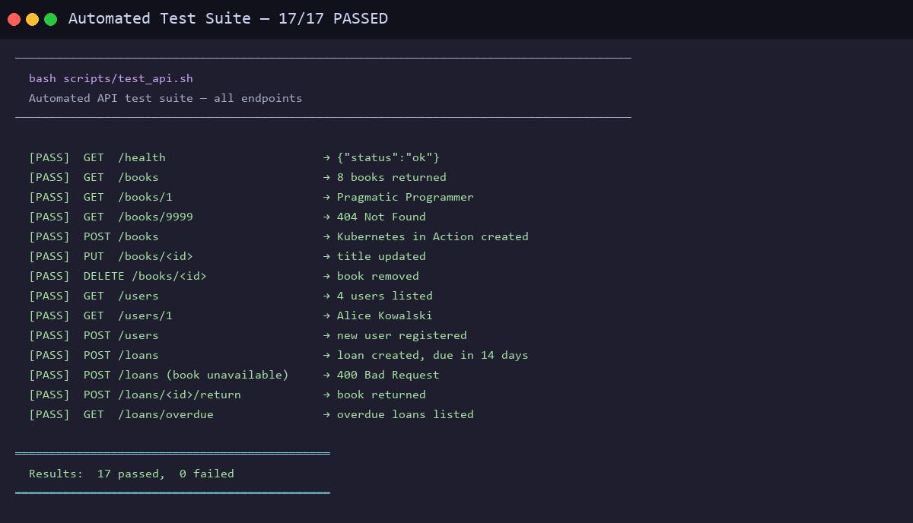

### Adminer — Visual Database Management (http://localhost:8080)
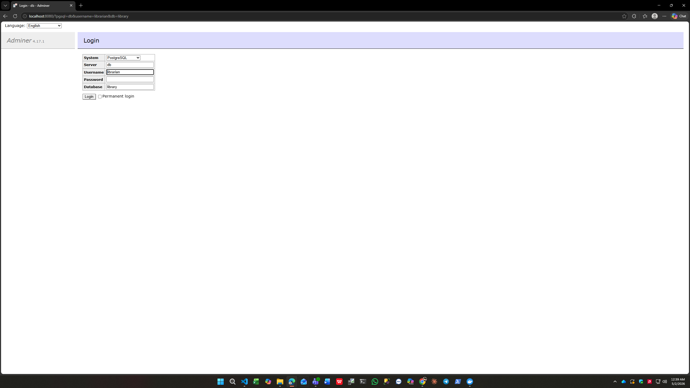

### API JSON Response in Browser (http://localhost:5000/books)
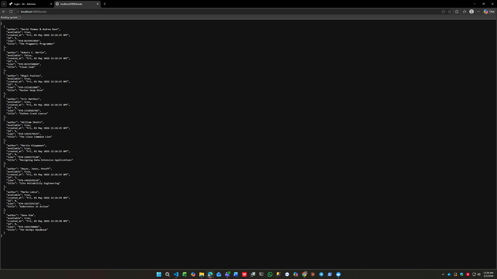

### Backup & Restore Scripts
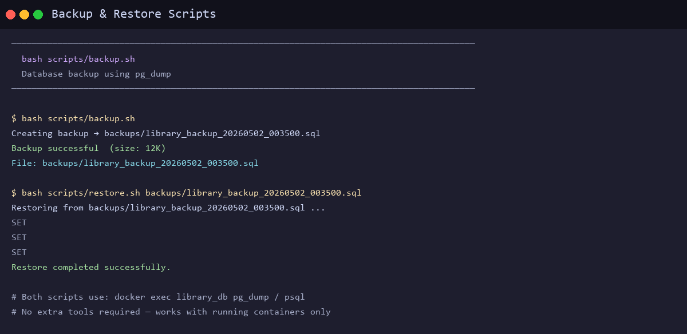

### Project Structure
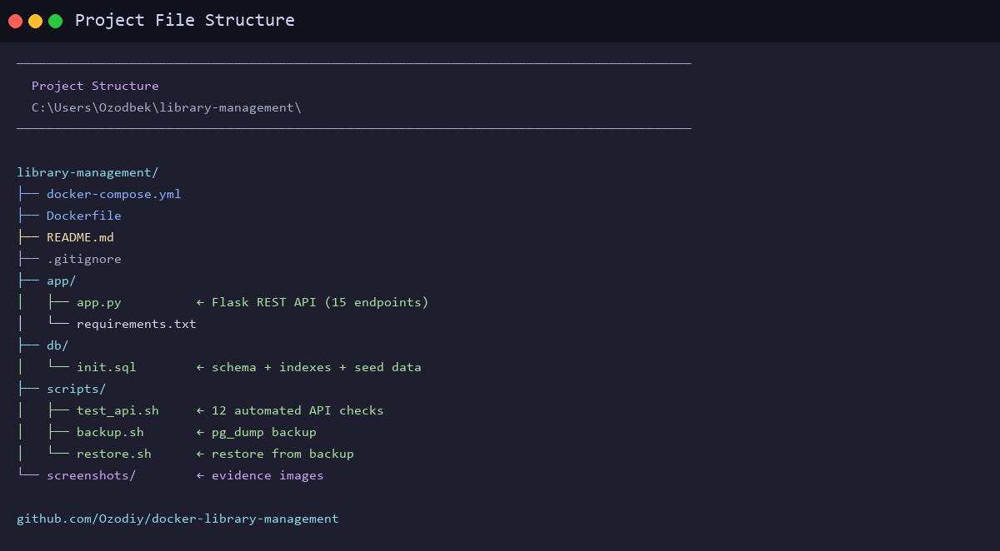

### docker compose up --build Output
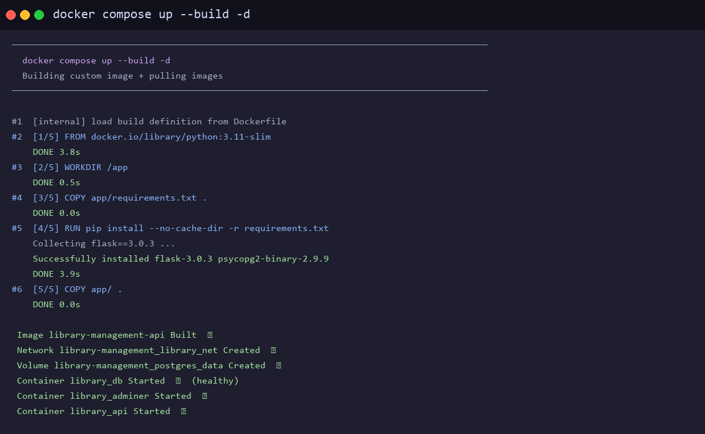

### Dockerfile
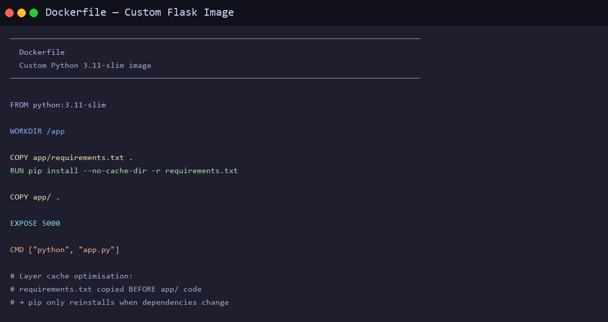

---

## Project Description

A containerized REST API for managing an academic library: books, registered users, and
book loans. The system tracks which books are available, assigns loans with automatic
14-day due dates, and flags overdue items.

**Real-life application:** Universities and schools use systems like this to automate
their physical or digital lending operations — replacing paper records with a queryable
API and a visual database admin panel.

---

## Architecture

```
┌─────────────────────────────────────────────────────┐
│                  Docker Network: library_net         │
│                                                     │
│  ┌──────────────┐     ┌──────────────┐              │
│  │  library_api │────▶│  library_db  │              │
│  │  (Flask)     │     │  (PostgreSQL)│              │
│  │  port 5000   │     │  port 5432   │              │
│  └──────────────┘     └──────┬───────┘              │
│                              │ named volume          │
│  ┌──────────────┐            │ postgres_data         │
│  │   adminer    │────▶───────┘                      │
│  │  port 8080   │                                   │
│  └──────────────┘                                   │
└─────────────────────────────────────────────────────┘
```

| Container       | Image              | Role                          | Port |
|-----------------|--------------------|-------------------------------|------|
| `library_api`   | Custom (Dockerfile)| Flask REST API                | 5000 |
| `library_db`    | postgres:15-alpine | PostgreSQL database           | —    |
| `library_adminer` | adminer:4        | Web-based DB admin panel      | 8080 |

---

## Technologies Used

- **Docker / Docker Compose** – container orchestration
- **Python 3.11 + Flask 3.0** – REST API framework
- **PostgreSQL 15** – relational database
- **psycopg2** – Python PostgreSQL driver
- **Adminer** – lightweight database GUI

---

## Project Structure

```
library-management/
├── docker-compose.yml       # Service definitions
├── Dockerfile               # Custom image for Flask API
├── app/
│   ├── app.py               # Flask application (all endpoints)
│   └── requirements.txt     # Python dependencies
├── db/
│   └── init.sql             # Schema + seed data (auto-loaded on first start)
├── scripts/
│   ├── test_api.sh          # Automated API test suite
│   ├── backup.sh            # PostgreSQL backup script
│   └── restore.sh           # Restore from backup
├── backups/                 # Backup output directory
└── README.md
```

---

## How to Run

### Prerequisites

- [Docker Desktop](https://www.docker.com/products/docker-desktop/) installed and running
- Git Bash or any Unix-style shell (for test/backup scripts)

### Step 1 – Clone / enter the project folder

```bash
cd library-management
```

### Step 2 – Build and start all services

```bash
docker compose up --build -d
```

This will:
1. Build the custom `library_api` image from `Dockerfile`
2. Pull `postgres:15-alpine` and `adminer:4` images
3. Start all three containers on the shared `library_net` network
4. Run `db/init.sql` to create tables and insert sample data
5. The API waits for the database health-check before starting

### Step 3 – Verify all containers are running

```bash
docker compose ps
```

Expected output:

```
NAME               STATUS        PORTS
library_api        Up            0.0.0.0:5000->5000/tcp
library_adminer    Up            0.0.0.0:8080->8080/tcp
library_db         Up (healthy)  5432/tcp
```

### Step 4 – Open the services

| Service  | URL                      | Notes                                 |
|----------|--------------------------|---------------------------------------|
| REST API | http://localhost:5000    | JSON responses                        |
| Adminer  | http://localhost:8080    | Login: see credentials below          |

**Adminer login credentials:**
- System: `PostgreSQL`
- Server: `db`
- Username: `librarian`
- Password: `secret123`
- Database: `library`

---

## API Reference

### Books

| Method | Endpoint           | Description            |
|--------|--------------------|------------------------|
| GET    | `/books`           | List all books         |
| GET    | `/books/<id>`      | Get book by ID         |
| POST   | `/books`           | Add a new book         |
| PUT    | `/books/<id>`      | Update book details    |
| DELETE | `/books/<id>`      | Remove a book          |

**POST /books – example body:**
```json
{ "title": "Docker Deep Dive", "author": "Nigel Poulton", "isbn": "978-1521822807" }
```

### Users

| Method | Endpoint       | Description           |
|--------|----------------|-----------------------|
| GET    | `/users`       | List all users        |
| GET    | `/users/<id>`  | Get user by ID        |
| POST   | `/users`       | Register a new user   |

**POST /users – example body:**
```json
{ "name": "Jan Kowalski", "email": "jan@example.com" }
```

### Loans

| Method | Endpoint                   | Description                            |
|--------|----------------------------|----------------------------------------|
| GET    | `/loans`                   | List all loans (with book/user names)  |
| POST   | `/loans`                   | Create a loan (sets 14-day due date)   |
| POST   | `/loans/<id>/return`       | Mark a loan as returned                |
| GET    | `/loans/overdue`           | List all overdue active loans          |

**POST /loans – example body:**
```json
{ "book_id": 1, "user_id": 2 }
```

---

## Quick curl Examples

```bash
# List all books
curl http://localhost:5000/books

# Add a book
curl -X POST http://localhost:5000/books \
  -H "Content-Type: application/json" \
  -d '{"title":"Clean Code","author":"Robert C. Martin"}'

# Register a user
curl -X POST http://localhost:5000/users \
  -H "Content-Type: application/json" \
  -d '{"name":"Alice","email":"alice@example.com"}'

# Create a loan
curl -X POST http://localhost:5000/loans \
  -H "Content-Type: application/json" \
  -d '{"book_id":1,"user_id":1}'

# Return a book
curl -X POST http://localhost:5000/loans/1/return

# Check overdue loans
curl http://localhost:5000/loans/overdue
```

---

## Running Automated Tests

```bash
bash scripts/test_api.sh
```

The script runs ~12 checks across all endpoints and reports PASS/FAIL for each.

---

## Backup and Restore

**Create a backup:**
```bash
bash scripts/backup.sh
# Output: backups/library_backup_YYYYMMDD_HHMMSS.sql
```

**Restore a backup:**
```bash
bash scripts/restore.sh backups/library_backup_20260501_120000.sql
```

---

## Stopping and Cleaning Up

```bash
# Stop containers (data is preserved in the volume)
docker compose down

# Stop and delete all data (volume too)
docker compose down -v
```

---

## Data Persistence

Book, user, and loan data is stored in the named Docker volume `postgres_data`.  
This volume survives `docker compose down` — only `docker compose down -v` removes it.

---

## Networking

All three containers communicate on the private bridge network `library_net`.  
The API connects to the database using the service name `db` as hostname — Docker's
built-in DNS resolves service names to container IPs automatically.  
Only ports 5000 (API) and 8080 (Adminer) are exposed to the host machine.
